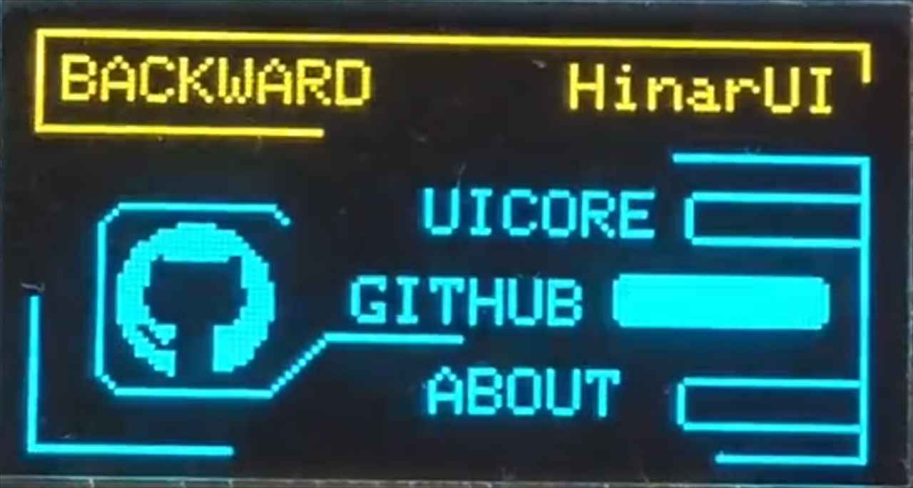
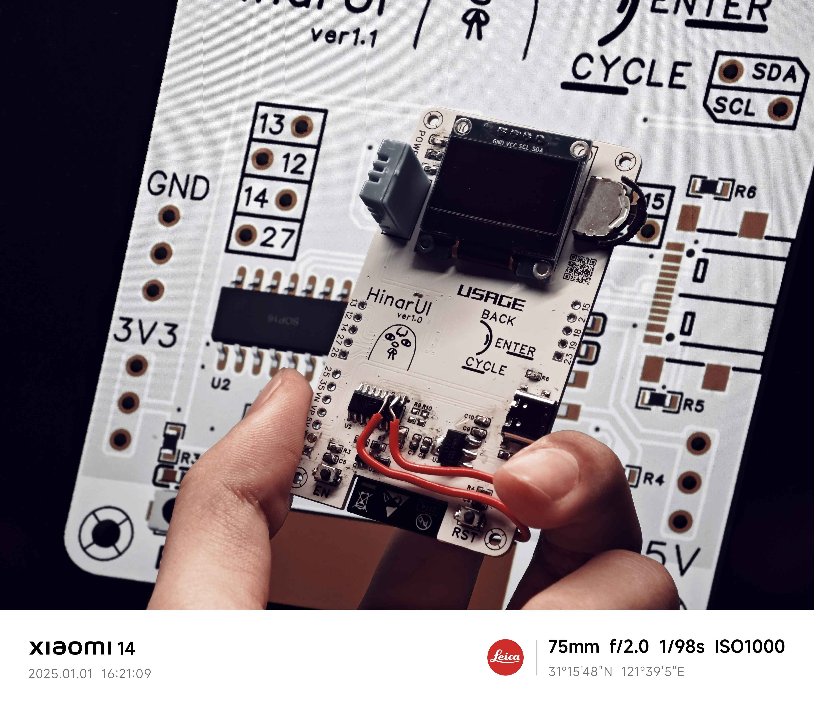

# HinarUI

Original OLED UI Design based on Embedded Platform, current exam on PlatformIO + ESP32-WROVER-E, aim to fit on various proportion of Embedded screen.

基于嵌入式平台的原创 OLED UI 设计，目前使用 PlatformIO + ESP32-WROVER-E 进行测试，长远计划是适应各种比例的嵌入式屏幕(maybe?)



By the way, all of it just try something i wanna to do...why not LVGL or other solution? Only because im excited about creating something by my own :)

## Current Status

It seems to be a little slow because everyday get so busy :(

- 2025.01.02 | Draw PCB (imperfect so not here)
- 2024.11.17 | Module init
- 2024.10.14 | Status Machine Rebuild
- 2024.10.12 | Icon on
- 2024.10.09 | base on

## Project Structure

Clone this project down will include these part, the Library "HinarUI" and an Example  

```plaintext
HinarUI
├─ example | Based on PlatformIO
│   ├─ .pio
│   ├─ include
│   ├─ lib ― HinarUI
│   ├─ src
│   └─ test
│
├─ resource | Header file
│   ├─ asset.h
│   ├─ icon.h
│   └─ font.h
├─ cpp | component
│   ├─ asset.cpp
│   └─ module.cpp
├─ UI.h
└─ UI.cpp
```

## Usage



*One way is to open the [EXAMPLE](/example/README.md) to understand.*

About how to adapt this project on your board, here gives some tips:

1. open `resource/asset.h` and modify these GPIO by your own

    ```cpp
    // OLED Setting
    #define OLED_SDA            21  
    #define OLED_SCL            22

    // KEY Setting
    #define KEY_ENTER           32
    #define KEY_BACK            34 
    #define KEY_CYCLE           33
    ```

2. open `cpp/asset.cpp` and modify the I2C address if not Default

    ```cpp
    // Default
    display.begin(SSD1306_SWITCHCAPVCC, 0x3C)
    
    // Another Possible
    display.begin(SSD1306_SWITCHCAPVCC, 0x3D)

    // Detail see: Adafruit SSD1306
    ```

3. It can normally run at this time of everything alright.

## Postscript

Thanks for u here whatever this project can or not helps you, any problem please use `issue` or contact me by [Gmail](mailto:linkjoestar402212@gmail.com)
