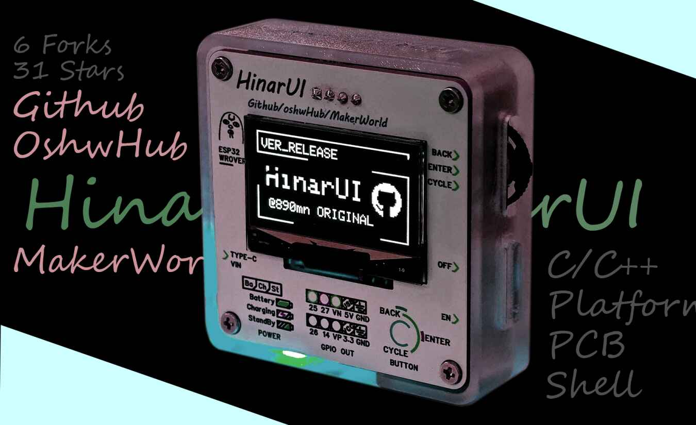
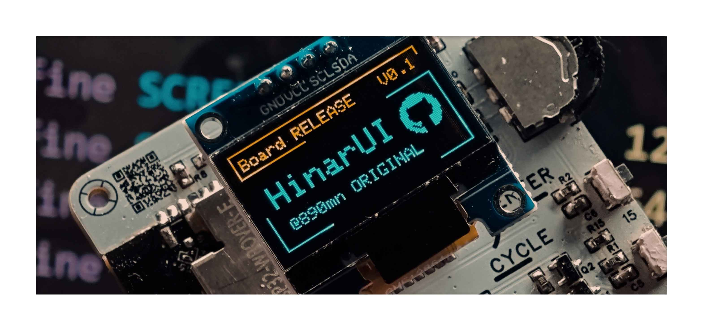

# HinarUI v3
    


Original OLED UI Design based on Embedded Platform, Develop in「 HinarUI Shell 」, with complete software, hardware and shell design

基于嵌入式平台的原创 OLED UI 设计，基于「 HinarUI Shell 」开发，具有完整的软硬件及外壳设计

By the way, all of it just try something i wanna to do...why not LVGL or other solution? Only because im excited about creating something by my own :)

## Current Status

It seems to be a little slow because everyday get so busy :(

- 2025.09.19 | Add Li Ver of PCB/Shell (V3)
- 2025.05.06 | Create Shell of the board (V2)
- 2025.03.25 | Complete TESTVer.0.2 and PCB (Scale with 1:1)
- 2025.01.02 | Draw PCB (imperfect so not here)
- 2024.11.17 | Module init
- 2024.10.14 | Status Machine Rebuild
- 2024.10.12 | Icon on
- 2024.10.09 | base on

## Project Structure

Clone this project down will include these part, the Library "HinarUI" and an Example  

```plaintext
HinarUI
├─ example
│   ├─ .pio
│   ├─ include
│   ├─ lib ― HinarUI
│   ├─ src
│   └─ test
├─ resource
│   ├─ asset.h
│   ├─ icon.h
│   └─ module.h
├─ fonts
│   ├─ Arame_Regular[5:10pt]7b.h
│   ├─ Cubano7pt7b.h
│   └─ optional.md  // Add custom font see this
├─ cpp
│   ├─ asset.cpp
│   └─ module.cpp
├─ UI.h
└─ UI.cpp
```

## Usage

Main Doc on my website: [Link2hinar](https://link2hinar.fun/p/hinarui/) |
Supporting design PCB at [oshwhub](https://oshwhub.com/link_joestar/hinarui-open-source-embedded-sel) |
Shell at [Makerworld](https://makerworld.com.cn/zh/models/1583584-hinarui-shell-v1)



*One way is to open the [EXAMPLE](/example/README.md) to understand.*

About how to adapt this project on your board, here gives some tips:

- open `resource/asset.h` and modify these GPIO by your own

    ```cpp
    #define OLED_SDA            21
    #define OLED_SCL            22

    #define SHT30_SDA           18
    #define SHT30_SCL           19

    #define KEY_ENTER           32
    #define KEY_BACK            35 
    #define KEY_CYCLE           33

    #define KEY_BACKUP          15
    ```

- open `resource/asset.h` and modify the OLED / SHT30 I2C address if not Default

    ```cpp
    // Default
    #define OLED_ADDR           0x3C
    #define SHT30_ADDR          0x44
    
    // Another Possible
    #define OLED_ADDR           0x3D
    #define SHT30_ADDR          0x45
    ```

- It can normally run at this time of everything alright

## Postscript

Thanks for u here whatever this project can or not helps you, any problem please use `issue` or contact me by [Gmail](mailto:linkjoestar402212@gmail.com)
