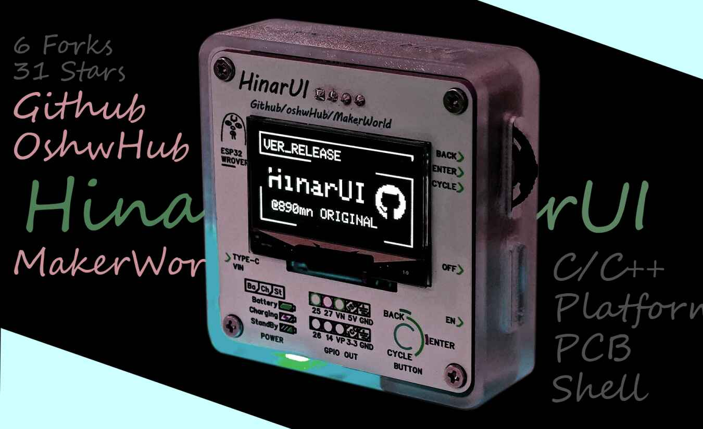
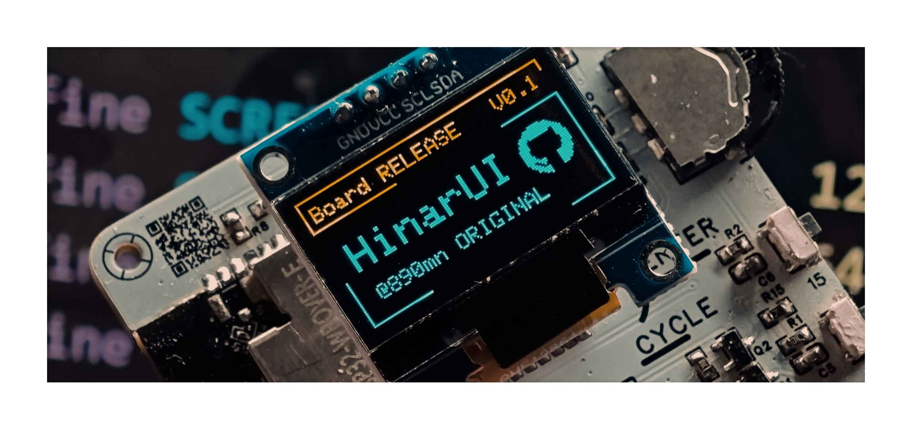

# HinarUI V1.0

Original OLED UI design for ESP32 embedded projects. HinarUI provides a compact
SSD1306 menu system, board profile configuration, sensor/status modules, and a
PlatformIO example for quick hardware bring-up.

基于 ESP32 和 SSD1306 OLED 的嵌入式 UI 库，包含菜单动画、板级配置、传感器/状态模块和
PlatformIO 示例工程。

## Status

- Target release: 1.0 Stable
- Default board profile: ESP-WROVER-KIT
- Default display: 128x64 SSD1306 over I2C
- Maintained library source: root `include/` and `src/`
- Example project: `example/`

## Project Structure

```text
HinarUI/
  include/                 Library public headers
    HinarUI/               Core types and renderer/display components
    boards/                Board profiles and pin/I2C definitions
    fonts/                 Built-in fonts
    modules/               Built-in module interfaces
  src/                     Library implementation
    boards/                Board initialization
    core/                  Display, framebuffer, animator, renderer, registry
    modules/               Built-in modules
  example/                 PlatformIO example project
  pic/                     README images
  library.json             PlatformIO/Arduino library manifest
```

The example depends on the root library through `symlink://..`, so changes in
`include/` and `src/` are used directly by the example build.

## Quick Start

```cpp
#include <Arduino.h>
#include "HinarUI_Core.h"

void setup() {
    menu.create();
}

void loop() {
    menu.loop();
}
```

Build the example from the repository root:

```powershell
pio run -d example -e esp-wrover-kit
```

Upload to a connected board:

```powershell
pio run -d example -e esp-wrover-kit --target upload
```

## Board Adaptation

Start with `include/boards/esp_wrover_kit.h`. A board profile should define:

- OLED I2C pins and address
- SHT30 I2C pins and address, if enabled
- key pins for OFF, ENTER, CYCLE, and BACK
- battery ADC and charge-sense pins, if enabled
- board initialization functions used by `Profile.h`

The default profile is selected by the `BOARD_ESP_WROVER_KIT` build flag in
`example/platformio.ini`.

## Module Extension

Built-in modules are registered by `MenuModuleRegistry`. User code can replace a
slot at startup:

```cpp
void myModule();

void setup() {
    menu.registerModule(0, {"CUSTOM", bitmap_default, myModule});
    menu.create();
}
```

The descriptor must provide a non-empty label, a bitmap pointer, and a handler.

## Links

- Main documentation: [link2hinar.fun](https://link2hinar.fun/p/hinarui/)
- Hardware design: [OSHWHub](https://oshwhub.com/link_joestar/hinarui-v4)
- Shell model: [MakerWorld](https://makerworld.com.cn/zh/models/1583584-hinarui-shell-v1)



## License / Contact

For questions or issues, use GitHub issues or contact
[linkjoestar402212@gmail.com](mailto:linkjoestar402212@gmail.com).
